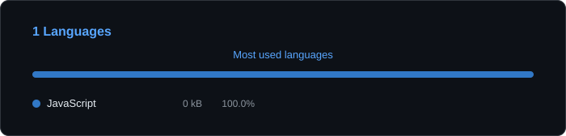

<picture>
  <source media="(prefers-color-scheme: dark)" srcset="assets/banner-dark.svg">
  <source media="(prefers-color-scheme: light)" srcset="assets/banner-light.svg">
  
</picture>

 

  

---

## This is me :)

Hi, I'm **Kashyap**, a Computer Engineering student who builds **AI-powered products** end to end: React frontends, APIs, and LLM agents that actually do things.

- 🥗 Built **NutriLink**, an AI nutrition & health assistant, deployed live on Vercel + Render
- 🤖 **Agent Developer** on **NudgeOS**, a multi-agent AI receptionist for WhatsApp/Instagram
- 🗓️ Designing a **Smart Appointment Queue Management System** with a weighted priority queue
- ⚛️ Daily driver: **React + Tailwind**, with **Gemini** and **Firestore** on the AI side
- 🌱 Learning by shipping: every project goes live, not just to `localhost`

---

## stack

---

## projects

### 🥗 NutriLink — AI Nutrition & Health Assistant

An AI-powered nutrition and health assistant with **food analysis, personalized coaching, and chat/voice interaction**.

- **Stack:** React · Tailwind · Google Gemini API · Firestore
- Accurate food-analysis outputs across multiple tested food items, with **API response times under 15 seconds**
- **Deployed independently:** frontend on Vercel, backend live on Render

[Live demo](https://nutri-link-2-0.vercel.app/)

### 🧠 NudgeOS — AI Receptionist for WhatsApp & Instagram

Capstone team project: a SaaS platform built around **five coordinated AI agents**. I'm the **Agent Developer**, owning the agent layer and the shared LLM service.

- **Stack:** JavaScript · Firestore · Gemini API

### 🗓️ Smart Appointment Queue Management System `In progress`

Full-stack platform where customers book appointments or join a digital queue, and providers manage counters and live queue status from an admin dashboard.

- **Stack:** Firestore · HTML/CSS/JS
- Unified **weighted priority queue** (walk-ins + appointments) with **aging** so nobody waits forever

---

## signals

<table>
<tr>
<td width="50%" align="center" valign="middle">
<picture>
  <source media="(prefers-color-scheme: dark)" srcset="assets/radar-dark.svg">
  <source media="(prefers-color-scheme: light)" srcset="assets/radar-light.svg">
  
</picture>
</td>
<td width="50%" align="center" valign="middle">
<picture>
  <source media="(prefers-color-scheme: dark)" srcset="assets/radar-langs-dark.svg">
  <source media="(prefers-color-scheme: light)" srcset="assets/radar-langs-light.svg">
  
</picture>
</td>
</tr>
</table>

---

## Numbers matter? ohhh yes.

<picture>
  <source media="(prefers-color-scheme: dark)" srcset="assets/stats-dark.svg">
  <source media="(prefers-color-scheme: light)" srcset="assets/stats-light.svg">
  
</picture>

 

<picture>
  <source media="(prefers-color-scheme: dark)" srcset="assets/languages-dark.svg">
  <source media="(prefers-color-scheme: light)" srcset="assets/languages-light.svg">
  
</picture>

---

<code>Build with love · @Coderclash-ceo</code>

